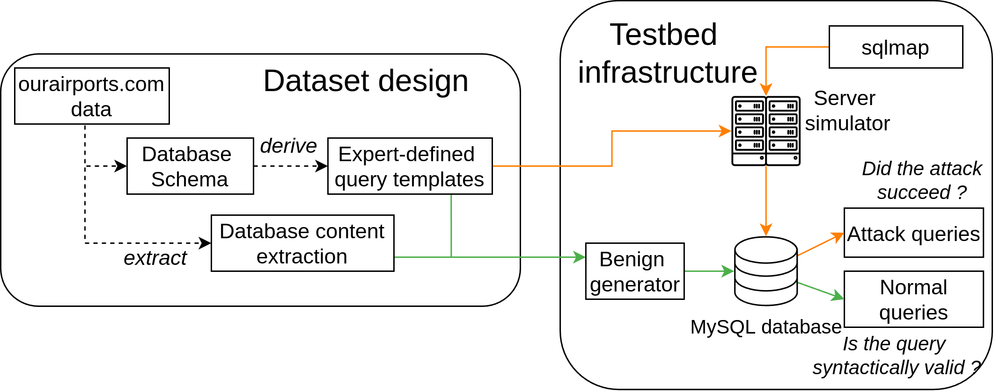

# SQL Injection Detection Dataset Generator

This repository contains the code used to generate high-quality SQL Injection Detection Datasets for evaluating unsupervised detection systems. Samples are built using query templates filled with legitimate values (normal samples) and [sqlmap](https://github.com/sqlmapproject/sqlmap/tree/1.8.7)-generated payloads (attack samples). This codebase was used to generate the [Superviz25-SQL Dataset](https://zenodo.org/records/17086037), published at ANUBIS 2025.

## Dataset Generation Strategy

This generator creates realistic SQL injection detection datasets through controlled emulation of web application endpoints and database attacks. It produces labelled datasets suitable for training and evaluating unsupervised anomaly detection systems.

<p align="center">
  
</p>

The dataset generation relies on **query templates** filled with legitimate values for normal samples and sqlmap-generated payloads for attack samples. Templates are SQL queries with placeholders enclosed in curly brackets:

```sql
SELECT * FROM airport WHERE icao_code = '{airports_icao_code}'
```

### Attack Sample Generation

#### SQL Injection Attacks

SQL injection samples are generated by simulating HTTP endpoints and launching sqlmap attack campaigns. For each endpoint:

1. **HTTP endpoint simulation**: A random subset of query templates is selected (mimicking applications where not all endpoints are externally accessible)
1. **Attack campaigns**: 6 campaigns per endpoint, each using a different sqlmap technique
1. **Two-phase attacks**:
   - **Reconnaissance**: sqlmap identifies working payloads with correct prefix/suffix combinations
   - **Exploit**: Data exfiltration using cached payloads (only if reconnaissance succeeds)

For diversity and realism, we leverage:

- `--eval`: Executes code before payload generation to provide diverse HTTP parameter values
- `--tamper`: Applies mutation scripts to bypass validation mechanisms

Example sqlmap invocation (reconnaissance phase):

```bash
sqlmap -v 3 --skip-waf --level=5 --risk=1 --batch \
  --skip='user-agent,referer,host' \
  --eval="import random;rand_medium_pos_number=random.choice([1119, 2223, 4662, 4035, 1104, 1387, 1005, 2743, 1376, 3825]);" \
  -p 'countries_code' \
  -tamper="space2comment" \
  --technique=Q \
  -u "http://localhost:8080/airport-S22?rand_medium_pos_number=3702&countries_code=LA"
```

All samples generated during campaigns are collected and included in the test set.

**Note on data exfiltration scope**: To reduce generation time, exploit phases use targeted exfiltration flags (`--users`, `--banner`, `--schema`, `--current-user`) instead of `--all`. To generate payloads that dump complete database contents (tables, columns, data), modify the techniques dictionary in the `generate_attacks` function in `src/sqlia_generator.py`.

**Database isolation**: Each dataset is generated with only its own database present in the MySQL instance. The launcher starts an isolated MySQL server, creates the database (`init_dataset_db`), runs generation, then stops the server (`stop_mysql_server` via `mysql-stop --clean`). This prevents sqlmap from enumerating unrelated schemas during `--schema` extraction, which would otherwise inflate boolean-based blind queries disproportionately.

#### Insider Threat Attacks

Insider attack samples are generated using sqlmap's direct connection mode with various enumeration objectives, simulating [insider threat](https://doi.org/10.1007/978-3-030-93956-4_11) campaigns.

### Normal Sample Generation

Normal samples are generated by filling templates with values from dictionaries. Configuration parameters:

- `attacks_ratio`: Proportion of attacks in the test set (e.g., 0.1 means 10% attacks, 90% normal). The training set always contains as many normal samples as there are attacks.
- `normal_only_template_ratio`: Reserves a proportion of templates for normal-only generation (never used to generate attacks), ensuring pattern diversity between attack and normal samples. Set to 0 to disable.

Example normal sample:

```sql
SELECT * FROM airport WHERE icao_code = 'LFPN'
```

More details are available in the paper: [Superviz25-SQL: High-Quality Dataset to Empower Unsupervised SQL Injection Detection Systems](https://hal.science/hal-05314211).

______________________________________________________________________

## Reproducing Superviz25-SQL

> **Note**: The published Superviz25-SQL dataset was generated using an earlier version of this codebase that used INI configuration files (`--ini`) instead of the current TOML format (`--config-file`). The Docker container reflects this older version. For new datasets, use the current TOML-based approach documented below.

This codebase was used to generate the [Superviz25-SQL Dataset](https://zenodo.org/records/17086037), published at ANUBIS 2025. The dataset uses the **OurAirports** database schema (derived from the OurAirports.com project) with query templates covering various SQL statement types.

**Citation**: If you use the dataset or code for your research, please cite:

```bibtex
@inproceedings{quetel:hal-05314211,
  TITLE = {{Superviz25-SQL: High-Quality Dataset to Empower Unsupervised SQL Injection Detection Systems}},
  AUTHOR = {Quetel, Gregor and Alata, Eric and Gimenez, Pierre-Francois and Robert, Thomas and Pautet, Laurent},
  URL = {https://hal.science/hal-05314211},
  BOOKTITLE = {{ANUBIS 2025 - 1st International Workshop on Assessment with New methodologies, Unified Benchmarks, and environments, of Intrusion detection and response Systems}},
  ADDRESS = {Toulouse, France},
  PAGES = {1-20},
  YEAR = {2025},
  MONTH = Sep,
  PDF = {https://hal.science/hal-05314211v1/file/anubis.pdf},
  HAL_ID = {hal-05314211},
  HAL_VERSION = {v1},
}
```

Full dataset generation takes approximately 10 hours.

### Environment Setup

Docker Container

> **Note**: The Docker container uses the older INI-based configuration (`--ini ini.ini`) that was used to generate the published dataset. Current development uses TOML configuration (`--config-file config.toml`).

Pull the pre-built container:

```bash
docker pull ghcr.io/gquetel/sqlia-dataset:1.0.0
```

Run the container:

```bash
$ docker run -it ghcr.io/gquetel/sqlia-dataset:1.0.0

Welcome to the Superviz-SQL25 Dataset Generator Container
----------------------------------------------------------

Available commands:

  ./setup-mysql.sh
      Initialize the MySQL server.

  python3 ./launcher.py --ini ini.ini --testing
      Run the generator in test mode.

  python3 ./launcher.py --ini ini.ini
      Generate the full dataset.

  docker cp <containerId>:/generator/dataset.csv ./dataset.csv
      (From the host) Copy the generated dataset to the host machine.

bash-5.2$
```

## Development

For development, or generating a dataset given other dataset specifications, we provide a Nix shell environment. Enter it using `nix-shell`. The environment contains all the runtime dependencies to generate such dataset and adds the `scripts/` directory to your `PATH`.

MySQL can then be managed with the provided helper scripts:

```bash
mysql-start        # Initialize and start the local MySQL dev server (port 61337)
mysql-stop         # Stop the MySQL dev server
mysql-stop --clean # Stop MySQL and remove all data
```

Alternatively, an equivalent environment can be manually created by using the following software versions:

- MySQL 8.4.5
- sqlmap 1.9.4
- pt-kill 3.2.0
- python 3.13, the dependency packages versions used are further detailed in requirements.txt.

Then, you could initialize MySQL as follows:

```bash
$ mkdir /usr/local/mysqld_1/
$ mysqld --initialize-insecure --basedir=/usr/local/mysqld_1/ --datadir=/usr/local/mysqld_1/datadir/
$ mysqld --basedir=/usr/local/mysqld_1/ --datadir=/usr/local/mysqld_1/datadir/ --port=61337 --daemonize
$ mysql -u root --skip-password --host=localhost --port=61337 -e "ALTER USER 'root'@'localhost' IDENTIFIED BY 'root'";
```

Initialize the unprivileged user using [bootstrap.sql](data/bootstrap.sql):

```bash
$ mysql --user=root --password=root --host=localhost --port=61337 < ./data/bootstrap.sql
```

This creates the unprivileged user required for query validation and sqlmap attacks. Dataset databases are created on-demand during generation (one at a time, for isolation).

### Creating New Datasets

To generate a dataset with different database schema, we require the following inputs:

- **Query templates**: in the form of CSV files. The file must contain the fields `template`, `ID`, optional `description` columns with `{placeholders}`.
- **Dictionaries**: Text files containing legitimate values, one per line

Optionally, you can include SQL scripts of normal queries as inputs. This is typically useful when you already possess small dumps of normal queries. Then, for each type of statement, write the associated template and labels the queries using comments (See [OHR script](data/datasets/OHR/insert.sql) for an example). Then, the tool will measure the repartition of templates. If more samples are required than those provided in the script, the tool will generate more using the normal samples and the template while respecting the specified template repartition.

In practice, you should create a folder under `data/datasets/` containing:

```
data/datasets/<dataset_name>/
├── init_db.sql          # Database schema definition
├── conditions.toml      # Optional: Variable-condition definitions
├── dicts/               # Dictionary files (one per placeholder)
├── queries/*.csv        # CSV templates (required)
└── *.sql                # Optional: Raw SQL with -- template-ID annotations
```

#### Variable-Condition Templates

Templates can use the special `{conditions}` placeholder to generate queries with a variable number of WHERE conditions. This simulates search forms where users fill different combinations of fields. To use this feature, create a `conditions.toml` file in the dataset directory defining which tables support variable conditions, which columns to use, and their types.

Each field can be typed (auto-generates patterns from `string`/`numeric`/`date` type) or custom (explicit pattern list for special cases like `FIND_IN_SET`):

```toml
[[table]]
name = "film"
select_columns = "film_id"
min_conditions = 2
max_conditions = 6

  [[table.field]]
  column = "title"
  dict = "film_title"
  type = "string"          # Auto-generates: =, LIKE, IN patterns

  [[table.field]]
  column = "release_year"
  dict = "film_release_year"
  type = "numeric"         # Auto-generates: =, >=, <=, BETWEEN patterns
```

Then add a template using `{conditions}` in the corresponding `queries/select.csv`:

```csv
"SELECT film_id FROM film WHERE {conditions}",sakila-S12,Search films using a flexible set of filter conditions.
```

During normal generation, the generator picks a random number of fields (within `[min_conditions, max_conditions]`) and a random pattern per field. For attack generation, one concrete condition set is frozen so sqlmap can inject into the resulting placeholders. An improvement would be to use the `--forms` option, but that's for future work.

You can test your specification through the `pytest` test suite by parametrizing the test functions in [test_launcher_integration](tests/test_database_schemas.py) with your dataset name.

Then, adjust the generation configuration options present the in `config.toml` file. They are as follows:

- **General settings**: `attacks_ratio`, `normal_only_template_ratio`, `seed`, `output_path`
- **MySQL connection**: `user`, `password`, `host`, `port`, privileged credentials
- **Dataset definitions**: Name and statement type proportions (must sum to 1)

Then, you can test your setup with a small subset (a few templates, error-based technique only):

```bash
python3 ./launcher.py --config-file config.toml --testing
```

If everything works fine, you can generate the complete dataset:

```bash
python3 ./launcher.py --config-file config.toml
```

#### Additional Options

- `--debug`: Verbose output with sqlmap payload details (verbosity level 3)
- `--no-syn-check`: Skip syntax validation of normal queries (faster generation)
- `--output-dir`: Specify output directory (default: `./output/`)
- `--ithreat-only`: Generate only insider threat attacks

**Note**: Random seeds are not fixed for sqlmap to preserve payload diversity. Therefore, generated datasets are structurally similar but may differ slightly in attack samples.

### Testing

The repository includes some integration tests which can be run using:

```bash
pytest
```

## Baseline Evaluation

The repository includes code to evaluate classical SQL injection detection pipelines on generated datasets.

#### Pipeline Components

**Feature Extraction** (3 methods):

- **CountVectorizer**: Word count-based approach
- **Manual Features**: SQL injection-specific features from ["A SQL Injection Detection Method Based on Adaptive Deep Forest"](https://doi.org/10.1109/ACCESS.2019.2944951)
- **SecureBERT**: Cybersecurity-specific BERT model from ["SecureBERT: A Domain-Specific Language Model for Cybersecurity"](https://doi.org/10.1007/978-3-031-25538-0_3)

**Novelty Detectors** (3 methods):

- **Autoencoder**: PyTorch implementation
- **Local Outlier Factor**: scikit-learn implementation
- **One-Class SVM**: scikit-learn implementation

Total: **9 pipeline combinations**

#### Running Evaluation

Code is available in the [models](./models/) folder. After generating a dataset:

```bash
cd models && python3 ./training.py

# Save a trained model to disk for later evaluation
cd models && python3 ./training.py --save-model-path /path/to/model.pth
```

To evaluate a saved model on a different test dataset, use `experiments/evaluate_model.py`.

## TODO:

- Standardize all output paths in scripts & notebooks loading data.
