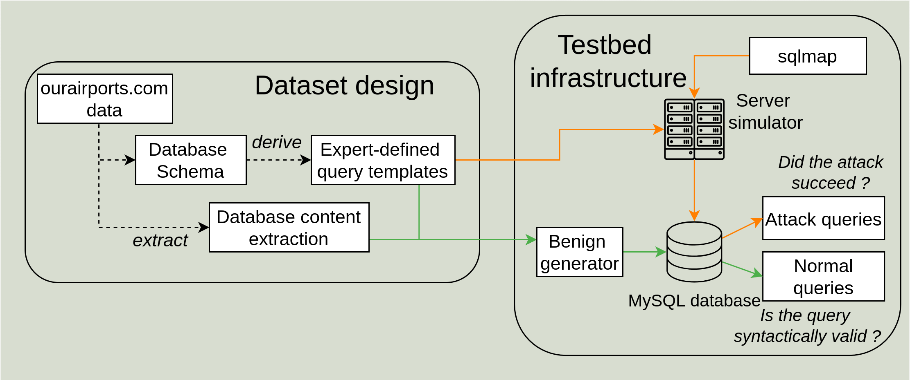

# SuperviZ25-SQL Generator 

This repository contains the code used to generate the SuperviZ25-SQL Dataset. This dataset is made to evaluate unsupervized SQL Injection detection techniques. Queries are built using query-templates derived in which normal values are inserted to construct normal samples. Attack samples are generated by the emulation of web application endpoints, on which [sqlmap](https://github.com/sqlmapproject/sqlmap/tree/1.8.7) attack campaigns are launched. 

## Dataset Generation Strategy

<p align="center">
  
</p>

The dataset generation relies on templates of queries, filled by legitimate values for normal samples generation, and `sqlmap` generated payloads for malicious samples. The inputs required for generation are these templates and dictionaries of values used to generate legitimate queries. Templates are made of a fixed string, and a variable part: placeholders. Placeholders must be declared by curly brackets as follows: 

```
SELECT * FROM airport WHERE icao_code = '{airports_icao_code}'
```

For the time being, query templates only comprise a single database schema ([airport](data/databases/airport/queries), derived from the ourairports.com website). Ultimately, adding new database schemas should only consist of adding a folder under [databases](./databases/) containing 2 subfolders : 
- `dicts`: Contains dictionary files. Each file's name must match a placeholder name used in query templates. 
- `queries`: Contains CSV files defining the query templates. Each file must include the following columns:
  - `template`: The SQL query template. Placeholders must be enclosed in curly braces ({}) and match a corresponding dictionary filename.
  - `ID`: A unique identifier for each template, ensuring traceability of generated samples.


### Generating attack samples 

Attack samples are generated from a random subset of query templates (mimicking an application where not all endpoints are rendered available to external entities). For each of them, we perform 6 campaigns of attacks. A campaign consist of invocations of `sqlmap` with a specific technique on an endpoint.  `sqlmap` is invoked multiple times: a reconnaissance step that aim to find a payload and the correct couple of prefix and suffix for each existing query parameter, and then an exploit step where data is exfiltrated using the cached identified payload. 

For more diverse and realistic result we use 2 options provided by the `sqlmap`:
- `--eval`: This option allows to specify code to execute before generating the payload, we use it to provide diverse values for HTTP query parameters. 
- `--tamper`: This option allows to specify a tamper script: a payload mutation tool aimed at bypassing weak validation mechanisms.

For instance, here is example of a `sqlmap` invocation for the reconnaissance step targeting the `countries_code` field for the template "airport-S22":

```
sqlmap -v 3  --skip-waf -D dataset --level=5 --risk=1 --batch --skip='user-agent,referer,host'  --eval="import random;rand_medium_pos_number=random.choice([1119, 2223, 4662, 4035, 1104, 1387, 1005, 2743, 1376, 3825]);"   -p 'countries_code'  -tamper="space2comment" --technique=Q -u "http://localhost:8080/airport-S22?rand_medium_pos_number=3702&countries_code=LA"
```

The exploit step only takes place if a working payload has been found during reconnaissance. All samples generated during these campaigns are collected and included in the test set.


### Generating normal samples

After generating malicious queries, normal samples are generated using dictionaries of legitimate values. The `attacks_ratio` defined in `ini.ini` will dictate how many normal samples will be included in the test set. For the training set, we generate roughly the same number of samples than generated attacks.

For instance, with the above query template, the generator will load the [data/databases/airport/dicts/airports_icao_code](data/databases/airport/dicts/airports_icao_code) file, and randomly select a value to create a normal sample such as: 

```
SELECT * FROM airport WHERE icao_code = 'LFPN'
```

## Generating the dataset locally

To preserve diversity in generated payloads, we do not fix random seeds when invoking `sqlmap`. As a result, while each generated dataset is similar in structure, it may differ slightly from the provided SuperviZ25-SQL dataset.

### Environment with nix-shell
We provide the environment to generate the dataset through a nix shell environment `shell.nix`. The environment contains: a MySQL server to validate normal queries to and execute attack ones (sqlmap requires interaction with a running DBMS to generate payloads), sqlmap and `percona-toolkit` from which the `pt-kill` command is used to make sure no lock on tables is present before the invocation of `sqlmap`. Finally, a python interpreter with packages dependencies (for both generation and training of models) is included.

### Manual environment

Alternatively, an equivalent environment can be manually created by using the following software versions: 
- MySQL 8.4.5
- sqlmap 1.9.4
- pt-kill 3.2.0
- python 3.12.10, the dependency packages versions used are further detailed in [requirements.txt](requirements.txt).

#### MySQL Initialization

We require that a MySQL server has been installed and initialized as depicted in the [documentation](https://dev.mysql.com/doc/refman/8.4/en/postinstallation.html). Then the server must be running and listening on a socket, specified in [ini.ini](ini.ini).

For instance, a MySQL server can be initialized as follows:
```
$ mkdir /usr/local/mysqld_1/
$ mysqld  --initialize-insecure --basedir=/usr/local/mysqld_1/ --datadir=/usr/local/mysqld_1/datadir/
$ mysqld -basedir=/usr/local/mysqld_1/ --datadir=/usr/local/mysqld_1/datadir/ --socket=/usr/local/mysqld_1/socket --daemonize 
$ mysql -u root --skip-password
> ALTER USER 'root'@'localhost' IDENTIFIED BY 'YourRootPassword';
```

Then, the content of the MySQL server must be initialized using [init_db.sql](data/init_db.sql): unprivileged user from which queries are executed must be created, as well as the database and tables to prevent errors on executing normal queries. The absence of the expected tables and database would also prevent `sqlmap` to finalize its attack. 

```
$ mysql --user=root  --socket=/usr/local/mysqld_1/socket < ./data/init_db.sql --password
```

### Generation

A few settings in the dataset generation can be modified in the [ini.ini](ini.ini) file such as the ratio of attacks in the resulting dataset or the distribution of statement types in the normal workload. 

To test that everything works as intended, the option `--testing` can be used. Where only 10 query templates will be considered to generate the dataset, and `sqlmap` is only invoked using the error-based technique which is relatively fast. The [launcher.py](launcher.py) script expect the path to the ini file as parameter as follows: 

```
python3 ./launcher.py  -ini ini.ini --testing
```

If everything works as intended, the full generation can be launched using:

```
python3 ./launcher.py -ini ini.ini 
```

Other options are available as follows: 
- `--debug`: Output will produce more information about the generation process, and sqlmap will display generated payloads (verbosity level 3).
- `--no-syn-check` The correct syntax of normal queries will not be verified, this speed up their generation.


## Baseline Evaluation

This repository also contains code to evaluate classical SQL Injection detection pipelines on the generated dataset. We implemented 9 different pipelines, based on the following feature extraction mechanisms: 
- CountVectorizer: A word count based approach.
- Manually Selected Features, specific to SQL Injection detection, derived from the paper "A SQL Injection Detection Method Based on Adaptive Deep Forest" (10.1109/ACCESS.2019.2944951)
- Sentence-BERT: A pre-trained on cybersecurity data BERT model used to compute a fixed-size vector representation of the query.

Combined with the following novelty detectors: 
- Autoencoder: Implemented using PyTorch
- Local Outlier Factor: Using the scikit-learn implementation.
- One-Class Support Vector Machines: Using the scikit-learn implementation.

The code is available in the [models](./models/) folder. Training and evaluation can be performed after generating a dataset using the following command: 

```
python3 ./training.py
```
